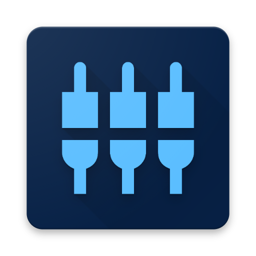

<h1 align="center">Deep Confusables similarity</h1>

<p align="center">
  
</p>

This project extracts all the `Unicode` image features to compare and creates a `confusables` file that we used in the `CLI`. More in detail, we use [VGG16 model](https://arxiv.org/abs/1409.1556), with weights pre-trained on [ImageNet](http://image-net.org).

We apply the neural network to extract the features of each one of the images. Then, we calculate the [cosine similarity](https://en.wikipedia.org/wiki/Cosine_similarity) between the `Basic Latin` and the rest of `Unicode` characters features. This process (`similarity.py`) generates a `similarity matrix` between `Basic Latin` and `Unicode` characters. With this similarity matrix (`similarities.txt`), we generate a file named `confusables.pickle` with the similar characters given a threshold between 0 and 1 (`threshold.py`). This file is used by the `CLI`.

## Getting started

### Prerequisites

Python version >= 3.5

### Installing

`pip3 install -r requirements.txt`

It depends on the following dependencies:

* `keras`
* `numpy`
* `scikit-learn`
* `h5py`
* `scipy`
* `tensorflow`

### Usage

#### similarity.py

Compute the similarity between Unicode and Latin characters by using transfer

```
username@host:~/path/to/unicode-similarity$ python3 similarity.py -h
usage: similarity.py [-h] [-i IMAGES] [-o OUTPUT] [-v]

Compute the similarity between Unicode and Latin characters by using transfer
learning.

optional arguments:
  -h, --help            show this help message and exit
  -i IMAGES, --images IMAGES
  -o OUTPUT, --output OUTPUT
  -v, --verbose

username@host:~/path/to/unicode-similarity$ python3 similarity.py -i path/to/unicode_database -o path/to/similarities.txt

```
#### threshold.py

Filter Unicode characters based on a given threshold and a similarity matrix

```
username@host:~/path/to/unicode-similarity$ python3 threshold.py -h
usage: threshold.py [-h] [-s SIMILARITY] [-i IMAGES] [-t THRESHOLD]
                    [-o OUTPUT] [-v]

Filter Unicode characters based on a given threshold and a similarity matrix

optional arguments:
  -h, --help            show this help message and exit
  -s SIMILARITY, --similarity SIMILARITY
  -t THRESHOLD, --threshold THRESHOLD
  -o OUTPUT, --output OUTPUT
  -v, --verbose

username@host:~/path/to/unicode-similarity$ python3 threshold.py -o path/to/confusables.pickle -s path/to/similarities.txt
```

### Demo

[](https://asciinema.org/a/AfxvUUPifuUi4tYlazGNAqt5U?autoplay=1)

## License

This project is licensed under the MIT License - see the [LICENSE](LICENSE) file for details.

## Contributing

Any collaboration is welcome!

There're many tasks to do.You can check the [Issues](https://github.com/next-security-lab/deep-confusables-similarity/issues) and send us a Pull Request.

## Authors

* José Ignacio Escribano Pablos - [@jiep](https://github.com/jiep)
* Miguel Hernández Boza - [@Miguel000](https://github.com/Miguel000)
* Alfonso Muñoz Muñoz - [@mindcrypt](https://github.com/mindcrypt)

<!-- Banner -->
<p align="center">
  
</p>
<h4 align="center" style="margin: -20px">Made with <span style="color:#e25555;">❤️</span> by <a Cybersecurity Lab @ <a href="https://www.bbvanexttechnologies.com">BBVA Next Techonologies</a> </h4>
